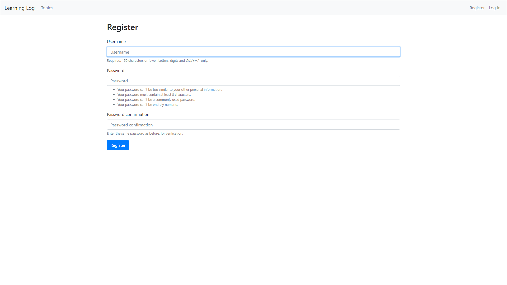

<h1>Блог</h1>

<h3>Полноценный готовый к работе блог созданый на базе Django с помощью bootstrap шаблонов и поддержкой пользователей.
Blog on Django base created with help bootstrap templates.</h3>

<figure>
<figcaption>
  <h3>Вид заглавной страницы.</h3>
Main page.
</figcaption>

</figure>

<figure>
<figcaption>
  <h3>Вид страницы регистрации.</h3>
Registration page.
</figcaption>

</figure>

<figure>
<figcaption>
  <h3>Вид страницы создания тем.</h3>
Topic,description creation page.
</figcaption>

</figure>

